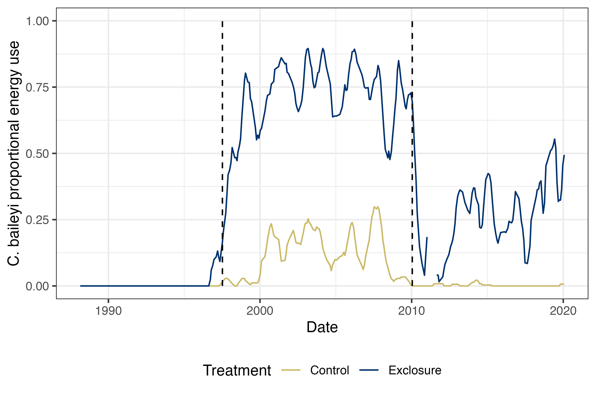
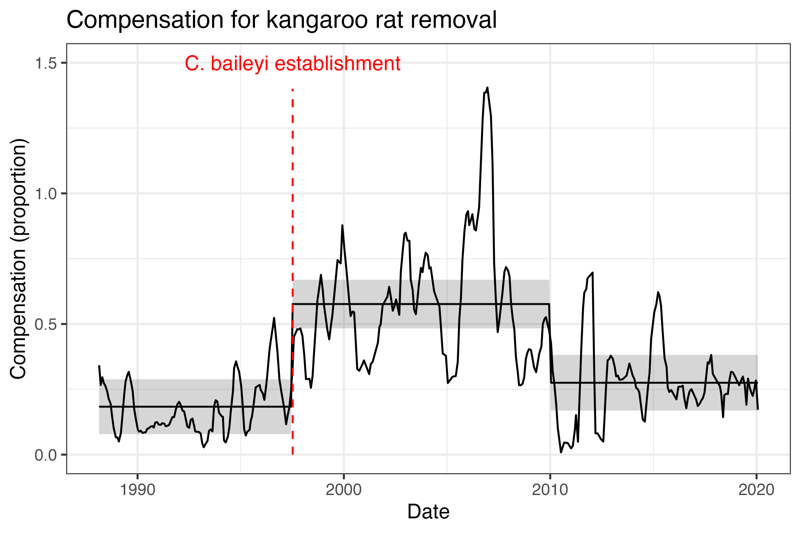

```{r setup, include=FALSE}
knitr::opts_chunk$set(echo = FALSE)
library(dplyr)
library(ggplot2)
theme_set(theme_bw())
```


# Macroecology and community ecology

## A macroecological approach to **community ecology**

How (and why) are _abundance_, _biomass_, and _resource use_ distributed among species in ecological communities?

How (and why) does this change over time?

How (and why) do species' dynamics combine to produce community-level phenomena?

## A **macroecological approach** to community ecology

"Community ecology is a mess"...

...but may contain "fuzzy generalities"


## A macroecological approach to community ecology

is grounded in **ecology**: 

- natural history
- experiments
- classic concepts

## A macroecological approach to community ecology

draws on **complex systems science**:

- data-intensive synthesis
- focus on emergent phenomena
- methods and concepts transcend disciplines


## A macroecological approach to community ecology


Focus on **community-level properties**
- Total **abundance**, **biomass**, **energy use**

**Distributions** among species and organisms 

<!-- here you will want to illustrate SADs and ISDs, at least. but also not sure if this slide even belongs here --> 


## Of rodents and randomness


1. How do community-level properties respond to species loss? _A long-term experimental perspective_
2. How do changes in community structure modulate long-term trends in biodiversity? _A continental-scale synthesis_
3. What can ubiquitous mathematical constraints on complex systems reveal about "laws" in community ecology? _A cross-disciplinary synthesis_


# I. Impacts of species loss on community function in a changing world

##


##

 

## Community function


## Community function

 

## Species loss directly impacts function


## Compensation can offset declines in function due to species loss


## Compensation linked to functional redundancy


## Functional redundancy may change over time


## Functional redundancy may change over time


##

**Impacts of species loss on community function may therefore be temporally variable and context dependent**


## The Portal Project


## The Portal Project


## The Portal Project


## The Portal Project


**How do community properties respond to kangaroo rat removal?**

## The Portal Project


**How do these responses change over time?**

## Community reorganization events



<!-- This may be a detour if I don't talk about the total energy thing -->

<!-- ## Long-term environmental change -->

<!-- (figure of Dipo % community energy use) -->

##

**How have shifts in community composition and species interactions affected how community function responds to kangaroo rat removal?**

## Compensatory dynamics linked to C. baileyi


## Compensatory dynamics linked to C. baileyi



## Compensatory dynamics linked to C. baileyi


<!-- this next may be a detour that we don't have time for --> 

<!-- ##  -->

<!-- (plot of total energy use) -->

<!-- Total energy use remains higher since 2010 than pre-1996 -->

<!-- ##  -->

<!-- (plot of total energy use) -->

<!-- (inset % dipo energy use) -->

<!-- The altered net effect is due to a long-term shift in community composition -->

## 

**Compensation for species loss is context dependent**

Species that compensate under some conditions may not under others

As conditions change, new species may be required to maintain or restore community function 

This may be difficult or impossible - especially in the Anthropocene

##

<!-- Like everything in science, this is only a piece of a larger story...for slightly more see -->


# II. Shifts in community structure modulate long-term trends in community-level properties

## Long-term trends in biodiversity

What are the long term trends in biological **abundance**?

Specifically, **community-level** abundance?


## Possible long-term trends


## Unpacking "abundance"

Number of *individuals*

Total *biomass*

These currencies are *linked*, but not *equivalent*

## Decoupling between different currencies


## Decoupling between different currencies


## Long-term trends in biodiversity

What are the long term trends in biological **abundance**?

How do changes in body size modulate trends in **number of individuals** and **total biomass**


## Barriers to synthesis

Aquatic, tree systems: Plentiful data and statistically well-behaved size structures

(plot of tree ISD?)


## Barriers to synthesis


## Recent advances 

Allometry --> estimates of size measurements

Statistical and null model approaches to work with complex ISDs and temporal dynamics

## Continental-scale synthesis

Breeding Bird Survey: Continental-scale citizen science beginning in 1963

High-performance computing for data-intensive synthesis

##

<!-- this slide may now be redundant with earlier -->

**What are the 30-year trends in abundance and biomass for breeding bird communities in North America?**

**Do these currencies have similar or contrasting trends?**

**How do changes in community structure decouple long-term trends in community-level properties?**

## Possible outcomes


## Long-term trends: outcomes


## 

(plot of abundance-driven dynamics)

Changes in community-wide **abundance** are dominated by declines

## 

(add plot of biomass-driven dynamics)

However, changes in community-wide **biomass** are equally split among declines and increases

<!-- ## energy use might be a detour-->

<!-- (add plot of energy-driven dynamics?) -->

<!-- And changes in **energy use** are again more similar to abundance -->


##

(Visualizing decoupling plot)

When abundance and biomass don't change together, biomass typically declines less than abundance.

##

(Add mean mass plot)

So **increases** in mean body size are offsetting change in biomass expected given change in abundance.


##

**Contrasts** with general concerns about size-biased extinctions/defaunation in the Anthropocene

**Consistent** with trends observed for BBS

**Illustrates** that these currencies are nonequivalent

## 

link to github repo

## 

link to github repo

add link to BBSsize github repo and pkgdown site; talk about scientific software in support of re-use/re-deployment of size data methods

# III. Ecological communities as complex systems: the species abundance distribution as a case study

## 

Community ecology is a mess

General phenomena = general process?

##


## Mathematical contributions to emergent phenomena

Illustrate feasible set

## "Statistical baselines" for ecological process

Illustrate deviation from feasible set

(include %ile score, use evenness)

## Questions

**How common are deviations from statistical baselines?**

**What do they suggest about ecological effects on the SAD?**

## Challenges

Sampling the feasible set is nontrivial --> thank you Hao!

Taxonomic breadth --> abundance data is widely available and highly general; 22k communities

Computational capacity, robust code --> HiPerGator

## Empirical SADs deviate from their baselines

(histogram may not be the best visualization of this)

## Deviations vary among different systems

(highlight Gentry communities - biological reasons)

## Deviations vary among different systems

(highlight FIA communities - small N problem)

## 

Statistical baselines are a promising approach; much more to dig into

Ecological applications will encounter challenges uncommon in e.g. physics

Modern computational methods can help navigate these challenges

##

link to scadsanalysis, feasiblesads, ecolett paper

# Acknowledgements

## Entities

NSF; Portal Project; data collection; HiPerGator; SNRE and WEC; weecology

## Humans

Mentors past and present: SKME, EPW, JG, JK, RMP

UF folks, esp. HY, EKB, JS, EMC, PKD, GMY, SZ, JBP

RKrh, TORN

## Questions


renata.diaz@weecology.org
https://diazrenata.github.io/home
